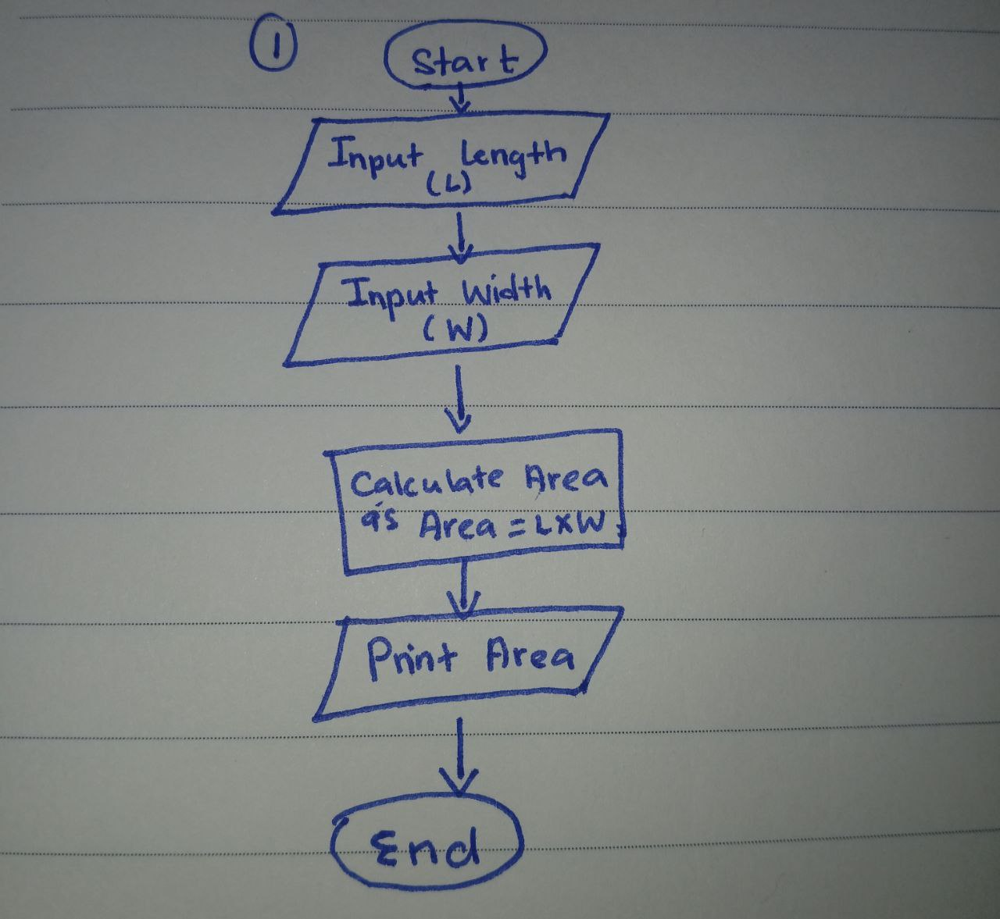
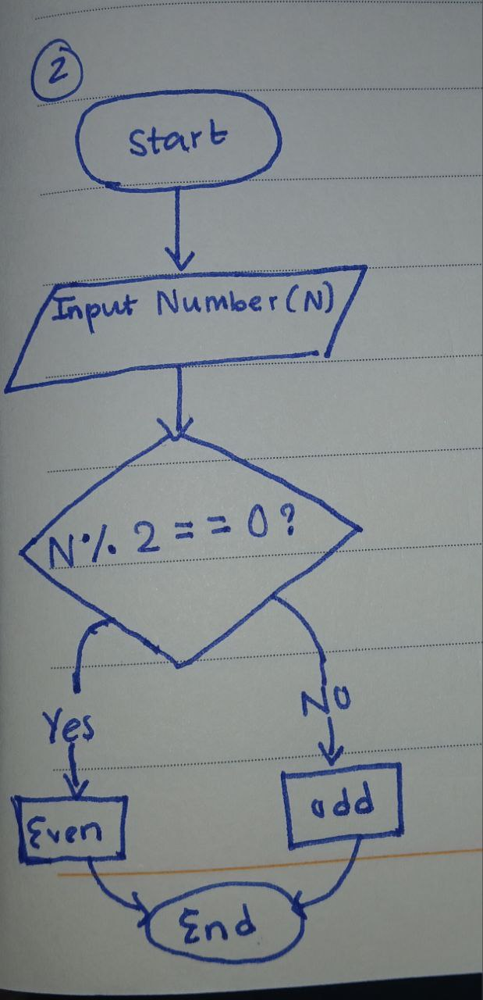
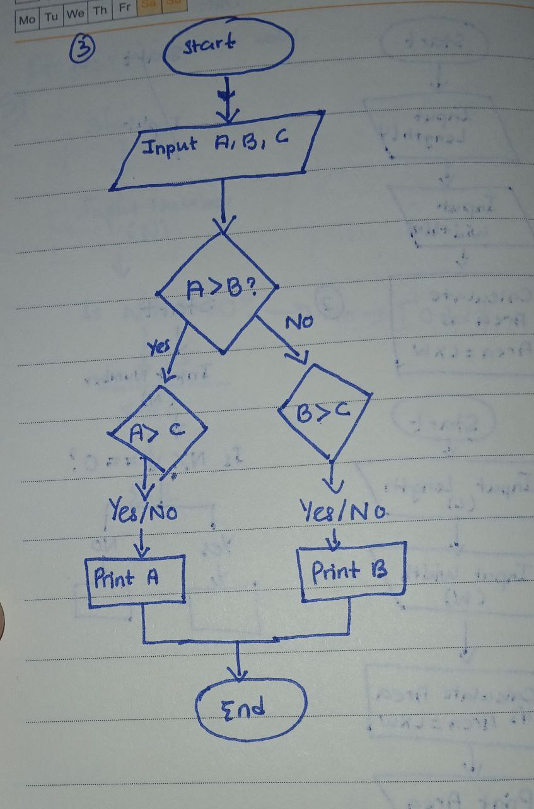
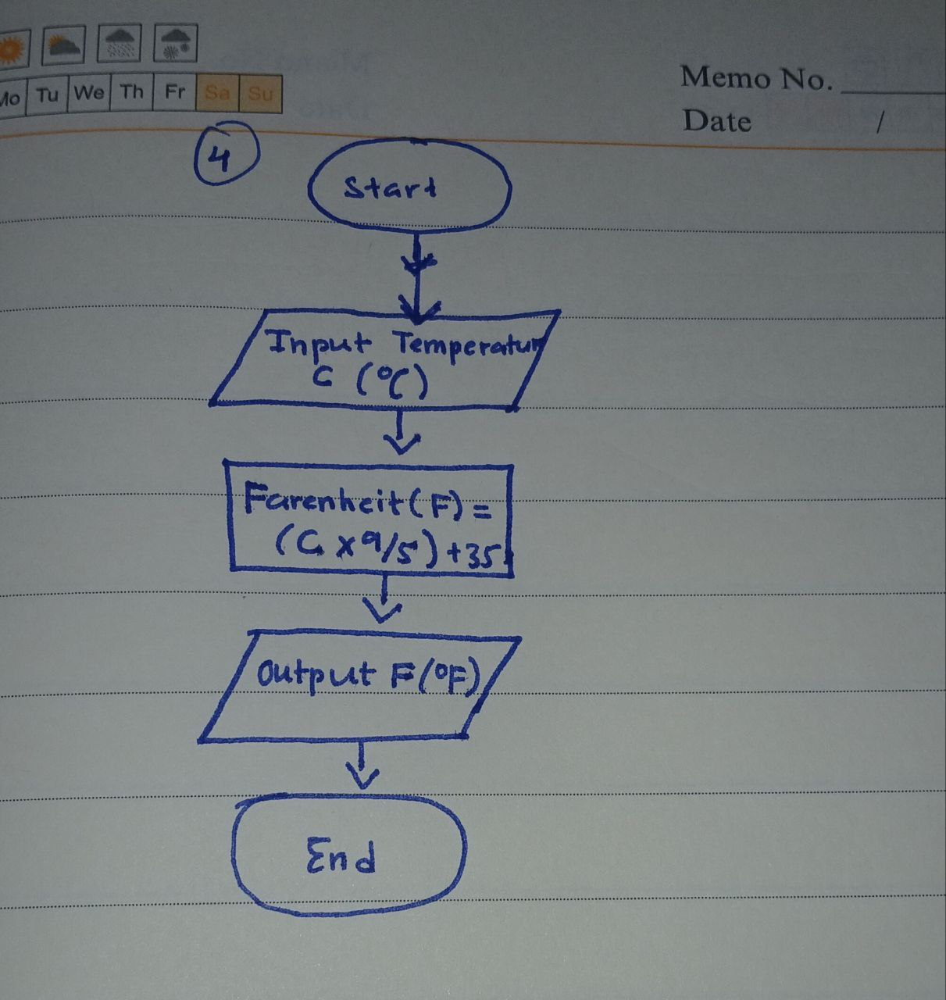

# **Exercise**
## **Create Flowcharts and Psuedocode for the following problems:**
#### NOTE:
  - For terms and topics you do not understand: **Google** to understand what they are.
  - Most of the terms are important computing terms/problems.
  - You need to practice Googling
## Level 1
  1. Calculate the area of a rectangle given its length and width.
  2. Determine if a number is even or odd.
3. Find the largest of three given numbers.
4. Convert temperature from Celsius to Fahrenheit

 
 
 
 

