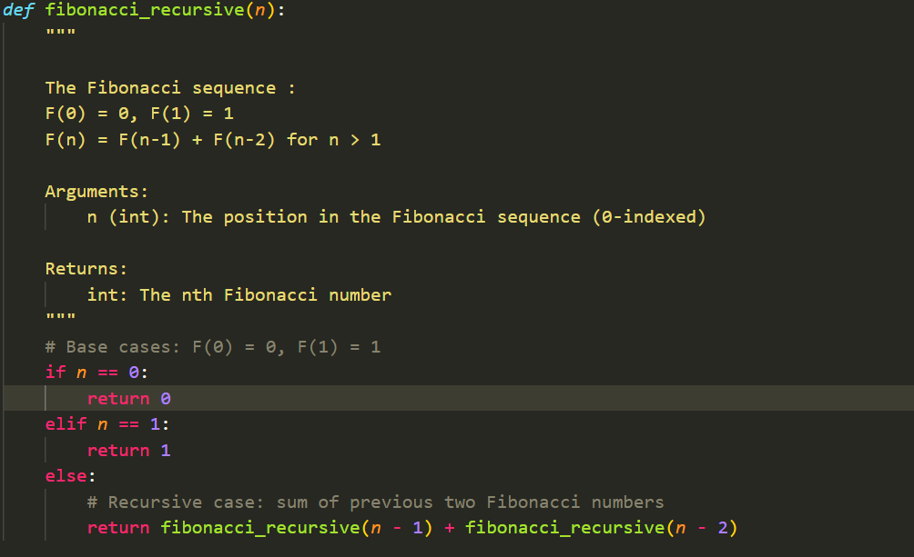
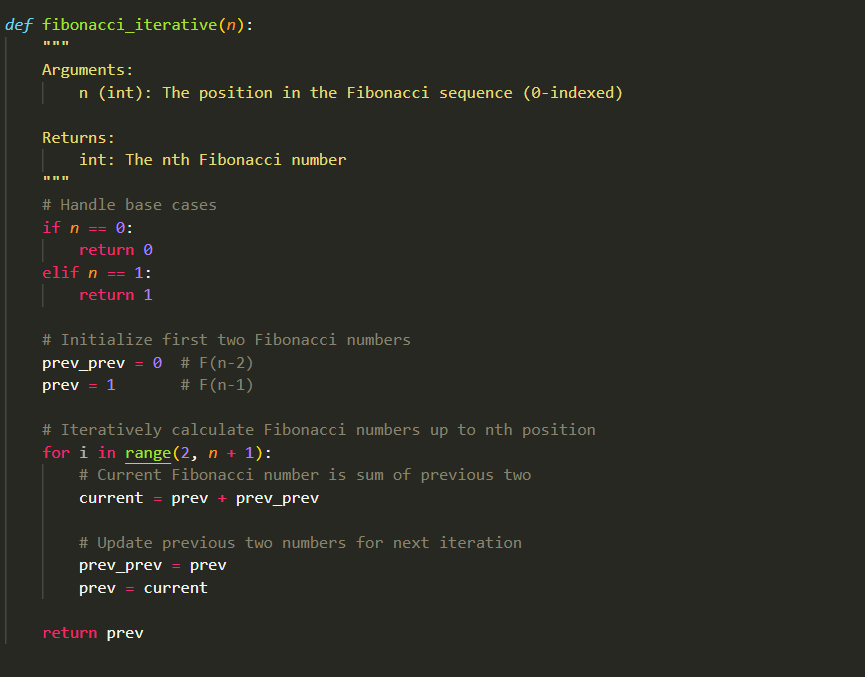

# **UNIT II**
### **Create two different implementations of a Fibonacci number generator:**
#### **1. Recursive Implementation:** 
Write a function that uses recursion (the function calls itself) to calculate the nth Fibonacci number.

#### **2. Iterative Implementation:** 
Write a function that uses loops to calculate the nth Fibonacci number without recursion.
#### **Requirements:**
- Both functions should take an integer n as input and return the nth Fibonacci number

- Comment your code to explain the logic

### Recursive Implementation
 

### Iterative Implementation
 

